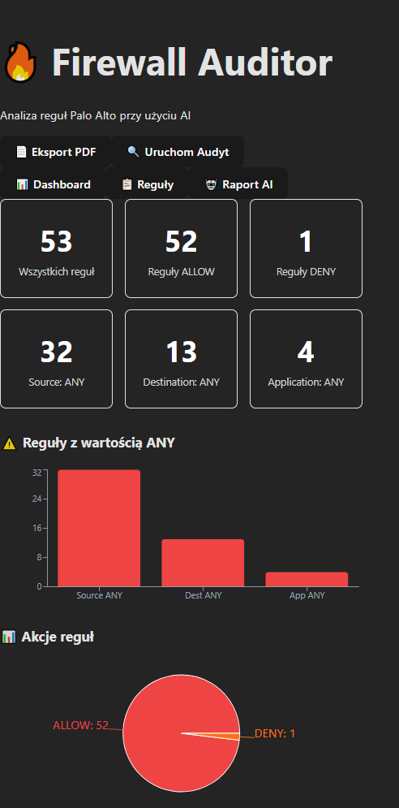
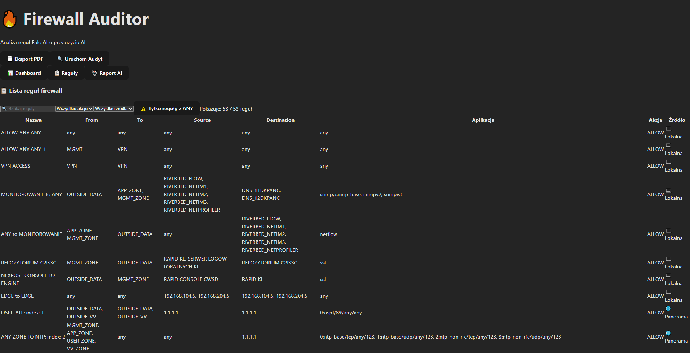
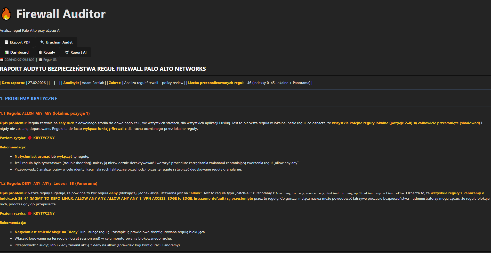

# 🔥 Firewall Auditor

## 📸 Screenshots





Aplikacja do automatycznego audytu reguł firewalla Palo Alto Networks przy użyciu AI (Claude).

## Funkcje
- Pobieranie reguł z Palo Alto (lokalnych i z Panoramy)
- Analiza bezpieczeństwa przez Claude AI
- Dashboard z wykresami i statystykami
- Filtrowanie reguł w tabeli
- Eksport raportu do PDF

## Stack
- **Frontend:** React + Tailwind CSS + Recharts
- **Backend:** Python + FastAPI
- **AI:** Anthropic Claude API
- **Integracja:** Palo Alto PAN-OS XML API

## Uruchomienie

### Backend
```bash
cd backend
pip install -r requirements.txt
uvicorn main:app --reload
```

### Frontend
```bash
cd frontend
npm install
npm run dev
```

## Konfiguracja
Stwórz plik `backend/.env`:
```
PA_HOST=https://<adres_firewall>
PA_API_KEY=<klucz_api_palo_alto>
ANTHROPIC_API_KEY=<klucz_api_claude>
```
